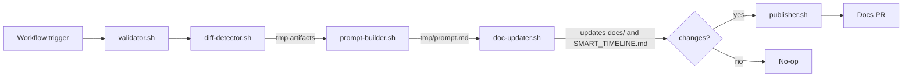

[](https://github.com/galiprandi/smart-doc/actions/workflows/smart-doc.yml)

# Smart Doc — Living, change‑driven docs from your diffs

Smart Doc is a GitHub Action that turns each merge into precise, change‑only documentation under `docs/`. It’s stack‑aware, PR‑first, and designed to keep protected branches protected while your docs stay fresh.

## Why teams use Smart Doc
- Change‑only updates: no wholesale rewrites; minimal churn.
- Stack‑aware scaffolding: backend, frontend, library, monorepo, infra — and Mermaid diagrams when useful.
- Code‑aware checks: cross‑references scripts, endpoints, env vars to fix obvious inconsistencies.
- PR‑first: opens a `smart-doc/docs-update-<sha>` branch and PR; compatible with protected branches and auto‑merge.
- Works with any stack. First‑class OpenAI support; adaptable to others.

## How it works (at a glance)
1) Detect the diff for the current run.
2) Build a focused prompt and generate concise docs under `docs/` (English only). Optionally append to `SMART_TIMELINE.md`.
3) Create/update `smart-doc/docs-update-<sha>` and open a PR; optionally auto‑merge when safe.

### Pipeline (Mermaid)


## Requirements
- GitHub Actions enabled on your repository.
- Secret: `SMART_DOC_API_TOKEN` (exported as `OPENAI_API_KEY`).
- Job permissions for PRs:
  - `permissions.contents: write`
  - `permissions.pull-requests: write`
- Optional: `GH_TOKEN` (PAT) if your org restricts `GITHUB_TOKEN`.

## Quick start (minimal workflow)
```yaml
name: Smart Doc
on:
  push:
    branches: [ main ]
    paths-ignore:
      - 'docs/**'
      - 'SMART_TIMELINE.md'
  pull_request:
    branches: [ main ]

concurrency:
  group: smart-doc-${{ github.workflow }}-${{ github.ref }}
  cancel-in-progress: true

jobs:
  update-docs:
    runs-on: ubuntu-latest
    permissions:
      contents: write
      pull-requests: write
    steps:
      - uses: actions/checkout@v4
        with:
          fetch-depth: 0

      - name: Smart Doc
        uses: galiprandi/smart-doc@v1
        with:
          smart_doc_api_token: ${{ secrets.SMART_DOC_API_TOKEN }}
          branch: main
          docs_folder: docs
          generate_history: 'true'
```

## More recipes and advanced options
See [`USAGE.md`](./USAGE.md) for:
- Triggers (GitFlow, release/*, PR‑only)
- Monorepo `paths` and selective updates
- PAT vs `GITHUB_TOKEN`, merge modes, and troubleshooting

## Model compatibility
- OpenAI (Codex / GPT‑5): first‑class
- Qwen / Qwen‑Code: configurable

## FAQ (short)
- Does it overwrite everything? No — only what’s relevant to the current diff.
- Mermaid diagrams? Yes, when they add value.
- Runs on PRs? Yes; preview‑only (no pushes). On `main`, opens a docs PR and can auto‑merge.
- Local preview? Yes — see contributor docs below for a test runner and diff injection.

### PR‑first behavior (example)
- After a push to `main`, Smart Doc creates a branch `smart-doc/docs-update-<short-sha>` and opens a PR.
- The PR contains only changes under `docs/` and optionally `SMART_TIMELINE.md`.
- You can enable auto‑merge (squash). If nothing meaningful was generated, no PR is opened.

## Contributing / Extending
This README is focused on users. If you want to contribute to Smart Doc or run local previews, see [`CONTRIBUTING.md`](./CONTRIBUTING.md).

## License
MIT

<!-- render-ping: 2025-09-12 -->
