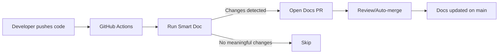

# 📚 Smart Doc — Living, change‑driven docs from your diffs

Smart Doc is a GitHub Action that turns each merge into precise, change‑only documentation under `docs/`. It’s stack‑aware, PR‑first, and designed to keep protected branches protected while your docs stay fresh.

## 🚀 Why teams use Smart Doc

- Change‑only updates: no wholesale rewrites; minimal churn.
- Stack‑aware scaffolding: backend, frontend, library, monorepo, infra — and Mermaid diagrams when useful.
- Code‑aware checks: cross‑references scripts, endpoints, env vars to fix obvious inconsistencies.
- PR‑first: opens a `smart-doc/docs-update-<sha>` branch and PR; compatible with protected branches and auto‑merge.
- Works with any stack. First‑class OpenAI support; adaptable to others.
- Bootstrap anywhere: run without installing the Action using the built‑in `bootstrap.sh` (great for CI and git hooks).

## 🧩 How it works (at a glance)

1) Detect the diff for the current run.
2) Build a focused prompt and generate concise docs under `docs/` (English only). Optionally append to `SMART_TIMELINE.md`.
3) Create/update `smart-doc/docs-update-<sha>` and open a PR; optionally auto‑merge when safe.

### 🧩 How it integrates in your CI



## 🧰 Requirements

- GitHub Actions enabled on your repository.
- Secret: `OPENAI_API_KEY` (your OpenAI API key).
- Job permissions:
  - `permissions.contents: write`
  - `permissions.pull-requests: write`
  - The default `GITHUB_TOKEN` is sufficient.

## ⚡️ Quick start (minimal workflow)

```yaml
name: Smart Doc
on:
  push:
    branches: [ main ]
    paths-ignore:
      - 'docs/**'
      - 'SMART_TIMELINE.md'
  pull_request:
    branches: [ main ]

concurrency:
  group: smart-doc-${{ github.workflow }}-${{ github.ref }}
  cancel-in-progress: true

jobs:
  update-docs:
    runs-on: ubuntu-latest
    permissions:
      contents: write
      pull-requests: write
    steps:
      - uses: actions/checkout@v4
        with:
          fetch-depth: 0

      - name: Smart Doc
        uses: galiprandi/smart-doc@v1
        with:
          openai_api_key: ${{ secrets.OPENAI_API_KEY }}
          model: gpt-5-mini
```

## 🍱 More recipes and advanced options

See [`USAGE.md`](./USAGE.md) for:

- Triggers (GitFlow, release/*, PR‑only)
- Monorepo `paths` and selective updates
- PAT vs `GITHUB_TOKEN`, merge modes, and troubleshooting

## ❄️ Cold start baseline (optional)

- If you enable `full_repo_when_missing_docs: true` and the `docs/` folder is empty, Smart Doc writes a minimal `docs/README.md` baseline on the first run. This guarantees a tangible artifact/commit for the first execution. Subsequent runs extend/replace this baseline based on diffs.

## 🧠 Model compatibility

## 🧠 Model selection

- Recommended model: `gpt-5-mini`.
- Override via workflow input: `with: model: gpt-5-mini` (or any accessible model for your key).
- The Action passes the model explicitly to the CLI (`--model <id>` when supported) and also exports `OPENAI_MODEL` and `CODEX_MODEL` for env‑based clients.
- If you see `401 Unauthorized`, your API key likely lacks access to the selected model.
- OpenAI (Codex / GPT‑5): first‑class
- Qwen / Qwen‑Code: configurable

## ❓ FAQ (short)

- Does it overwrite everything? No — only what’s relevant to the current diff.
- Mermaid diagrams? Yes, when they add value.
- Runs on PRs? Yes; preview‑only (no pushes). On `main`, opens a docs PR and can auto‑merge.
- Local preview? Yes — see contributor docs below for a test runner and diff injection.

### PR‑first behavior (example)

- After a push to `main`, Smart Doc creates a branch `smart-doc/docs-update-<short-sha>` and opens a PR.
- The PR contains only changes under `docs/` and optionally `SMART_TIMELINE.md`.
- You can enable auto‑merge (squash). If nothing meaningful was generated, no PR is opened.

## 🤝 Contributing / Extending

This README is focused on users. If you want to contribute to Smart Doc or run local previews, see [`CONTRIBUTING.md`](./CONTRIBUTING.md).

## 📄 License

MIT

## ⚓️ Use as hook (no Action required)

Run Smart Doc remotely via the bootstrap script. It soft‑fails on missing secrets and never breaks your pipeline.

- Local/CI one‑liner (after exporting `OPENAI_API_KEY`):
  - `curl -fsSL https://raw.githubusercontent.com/galiprandi/smart-doc/v1/bootstrap.sh | bash`

Git pre‑push (remote, recommended)
Create `.git/hooks/pre-push` and make it executable `chmod +x .git/hooks/pre-push`:

```bash

#!/usr/bin/env bash
set -euo pipefail

# Optional: load .env (provides OPENAI_API_KEY)
if [ -f .env ]; then
  set -o allexport; source .env; set +o allexport
fi

# Run Smart Doc via bootstrap (soft‑fail; never blocks push)
echo "📥 Downloading and running Smart Doc bootstrap..."
curl -fsSL https://raw.githubusercontent.com/galiprandi/smart-doc/v1/bootstrap.sh | bash

# Optionally include generated docs in this push
if ! git diff --quiet -- docs; then
  # Asegura incluir nuevos/eliminados/modificados dentro de docs
  git add -A docs || true
  if ! git diff --cached --quiet; then
    git commit -m "docs: update generated docs (pre-push)"
    echo "📚 New docs included in this push."
  fi
fi

exit 0

```
