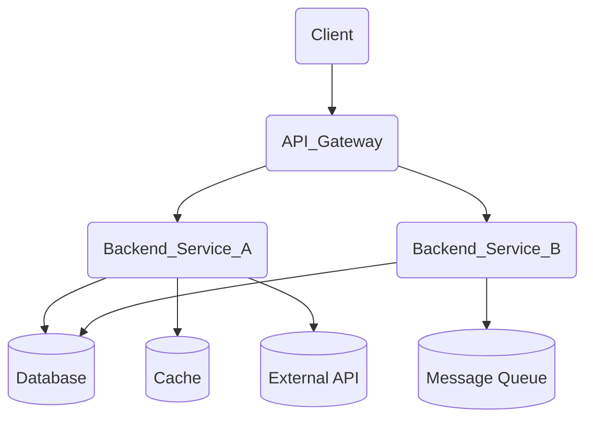

/docs/README.md
# Project Documentation

Purpose
- Document the architecture, stack, and module surfaces of the project.
- Provide an easy-to-navigate, developer-friendly reference for current and future contributors.

High-level capabilities
- Describe the system goals, core components, and data flows.
- Capture stack details, dependencies, and deployment considerations.
- Offer module-level documentation for each major package or service as the codebase evolves.

Table of contents
- [Stack](./stack.md)
- [Architecture Overview](./architecture/overview.md)
- [Architecture Diagram](./architecture/diagram.md)
- [Modules](./modules/README.md)
- (API docs, if applicable, to be added under /docs/api)

Note
- This document, and the repository docs, are intended to be incremental and additive. If a section is not applicable, it can be omitted or marked TBD. If more details become available, update accordingly.

---

/docs/stack.md
# Stack and Build Details

Dominant language/frameworks
- Language(s): TBD
- Main frameworks: TBD
- Key libraries: TBD
- Versions: TBD

Build, runtime, and tooling
- Node.js / NPM / PNPM / Yarn: TBD
- Python / Poetry / pip: TBD
- Java / Maven / Gradle: TBD
- Go / Modules: TBD
- Rust / Cargo: TBD
- Docker / Docker Compose: TBD
- Make / Taskfiles: TBD

External services and dependencies
- Databases: TBD
- Message queues / event buses: TBD
- Caches: TBD
- External APIs / services: TBD

Environment and runtimes
- Operating systems: TBD
- Runtimes: TBD
- Package managers/tools: TBD

Notes
- All tooling and versions should be filled by inspecting manifests (e.g., package.json, pyproject.toml, go.mod, Cargo.toml, Gemfile, requirements.txt) when available.
- If multiple packages/services exist (e.g., monorepo), consider listing per-package details or creating per-package sections.

---

/docs/architecture/overview.md
# Architecture Overview

System goals
- TBD

Constraints
- TBD

Key quality attributes
- TBD

Logical components and responsibilities
- Frontend/UI layer: TBD
- Backend services: TBD
- Data access / persistence: TBD
- Authentication/Authorization: TBD
- API surface / integration layer: TBD
- Other cross-cutting concerns (config, secrets, observability): TBD

Data flow and integration points
- Client interactions flow through the API surface to backend services and data stores.
- Backend services communicate with data stores, caches, queues, and external APIs as needed.
- Authentication and authorization gates the requests at the service boundary.
- TBD: Provide a detailed data flow narrative once components are named in code.

Deployment/runtime context
- Containerized deployment with Docker/CaaS as applicable: TBD
- Orchestration: TBD
- Observability and logging integration: TBD

Operational concerns
- Configuration management: TBD
- Secrets management: TBD
- Observability (metrics, tracing, logging): TBD
- Scaling strategy: TBD
- Backups and disaster recovery: TBD

---

/docs/architecture/diagram.md
# Architecture Diagram

Note
- The diagram below is a starting point and should be updated with project-specific component names derived from the codebase.

Mermaid diagram (container/component view)

```

Notes
- Replace placeholders (Client, API_Gateway, Backend_Service_A, etc.) with actual component names from the codebase.
- If there are multiple apps/services, add them as distinct nodes and show their interactions accordingly.

---

/docs/modules/README.md
# Modules Documentation

Overview
- This repo-wide docs scaffold assumes modular, package-by-package documentation. If modules are detected in the code layout, create a dedicated <module>.md for each major module/package under this folder.

Current state
- TBD: No modules documented yet.
- TBD: Add per-module docs under /docs/modules/<module>.md as modules are identified (e.g., src/server, services/auth, data/db, etc.).

Guidance for contributors
- For each module, capture:
  - Purpose and responsibilities
  - Public APIs/contracts
  - Key entities/types and important functions/classes
  - In/Out dependencies within the repo (who uses it; what it uses)
  - Risks and TODOs
- Link to code paths using relative links (e.g., ../../src/module/file.ts).

---

HISTORY.md
## [Docs scaffolding and initial structure]
- Date: 2025-09-12
- Author: AI Assistant
- Scope: Documentation scaffolding for project docs
- TL;DR: Initialize docs with stack, architecture, and diagram scaffolding plus module skeletons; add a placeholder for module docs and an initial architecture diagram.
- Jira: TBD
- Clickup: TBD

Notes
- This is an initial scaffolding. Populate details by analyzing the codebase manifests, module layout, and deployment configuration.
