# Architecture

Last updated: 2025-09-21T16:57:33Z  (commit `254105f`)

Smart Doc is implemented as a composite GitHub Action whose primary responsibility is converting repository diffs into up-to-date documentation under `docs/` and optionally appending to `SMART_TIMELINE.md`.

High-level pipeline (minimal, grounded in repository files):

```mermaid
flowchart LR
  A["entrypoint.sh / smart-doc.sh"] --> B["validator.sh (scripts/validator.sh)"]
  B --> C["diff-detector.sh (scripts/diff-detector.sh)"]
  C --> D["prompt-builder.sh (scripts/prompt-builder.sh)"]
  D --> E["doc-updater.sh (scripts/doc-updater.sh) / Codex CLI"]
  E --> F["publisher.sh (scripts/publisher.sh) — opens PR via gh"]
  subgraph Fallback
    A --> G["minimal timeline append (entrypoint fallback)"]
  end
```

Notes:
- The repository includes a minimal fallback (`smart-doc.sh` / inline `entrypoint.sh` behavior) that appends a compliant line to `SMART_TIMELINE.md` and opens a PR. This is used for observability when the model/CLI path is unavailable.
- The canonical pipeline is implemented in `entrypoint.sh` and the `scripts/` folder (see `modules.md`).
- The action is careful not to push directly to protected branches; it opens PRs with branch prefix `smart-doc/docs-update-`.
