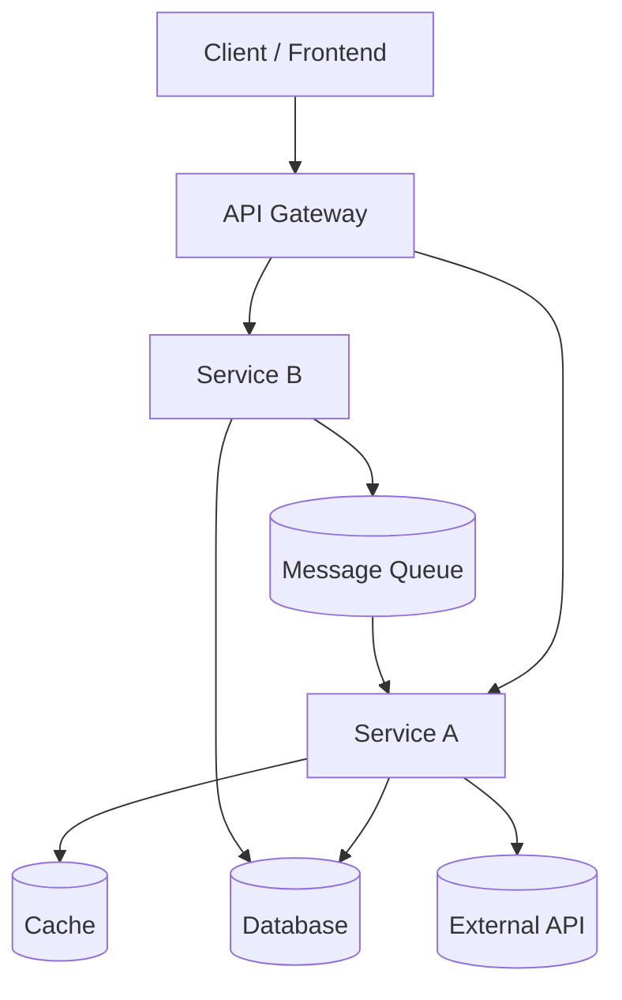

# Architecture Diagram

Mermaid diagram illustrating high-level components and their interactions. Replace TBD components with actual names from the codebase when available.

Notes
- This diagram uses generic names. TBD: Replace with actual component names from the repository.
- If your project has multiple apps (frontend, backend services), consider adding separate diagrams per app/service and an integration diagram showing cross-service calls.

