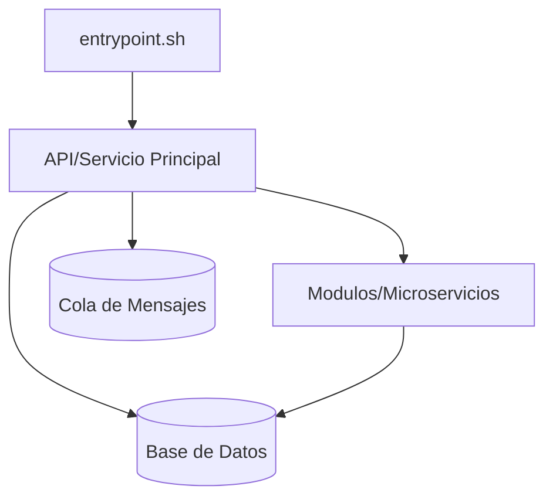

Notas
- Este diagrama es un esqueleto inicial. Ajustar para reflejar componentes reales tras analizar el diff.
- Agregar nodos/relaciones adicionales según los módulos detectados en el repositorio.

