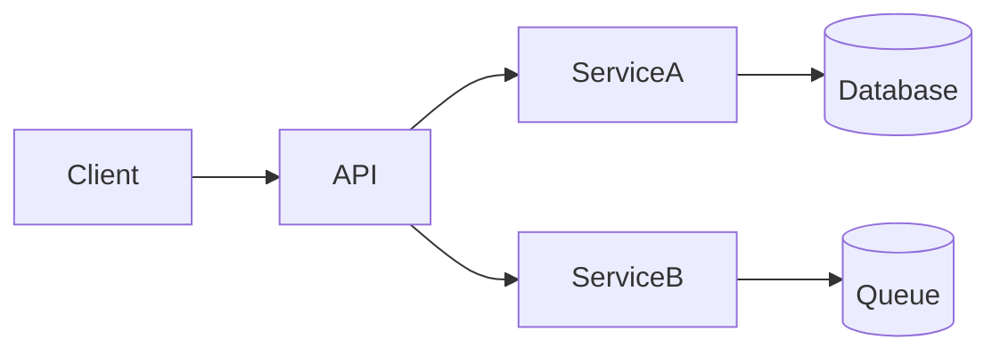

Actúa como agente en Codex CLI dentro de este repositorio. Objetivo: crear o actualizar documentación técnica bajo `docs/` sin modificar código.

Alcance y entregables (crear/actualizar exactamente estos archivos):
- `docs/README.md`
- `docs/stack.md`
- `docs/architecture/overview.md`
- `docs/architecture/diagram.md`
- `docs/modules/…` (un archivo por módulo detectado)

Contenido esperado por archivo:
- `docs/README.md`: descripción breve del proyecto, quickstart, comandos comunes, estructura de carpetas, enlaces al resto de docs.
- `docs/stack.md`: lenguajes, frameworks, librerías clave, herramientas de build/test, cómo se integran.
- `docs/architecture/overview.md`: objetivos, límites de contexto, flujos principales, decisiones notables (resumen ADR).
- `docs/architecture/diagram.md`: un solo bloque Mermaid válido con componentes y dependencias (p. ej. `flowchart LR`).
- `docs/modules/<nombre>.md`: plantilla por módulo con: Propósito, Responsabilidades, Archivos clave, Dependencias internas/externas, API pública, Riesgos/Supuestos, TODOs.

Reglas de salida:
- Usa un único patch con marcadores exactos. Empieza con `*** Begin Patch` y termina con `*** End Patch`.
- Dentro, usa operaciones `*** Add File:` o `*** Update File:` y diffs mínimos por archivo.
- No imprimas nada fuera del patch.
- Si algo no es inferible, añade “TODO:” y continúa.
- Mantén el idioma en español y títulos consistentes.

Descubrimiento:
- Escanea el repo con comandos de solo lectura (p. ej., `rg --files`, `rg <patrón>`).
- Infiera módulos por estructura (carpetas/paquetes) y relaciona dependencias a partir de imports/referencias.

Validación del diagrama:
- Asegura que el Mermaid compila lógicamente: nombres de nodos simples, sin caracteres especiales.

Restricciones:
- No toques código; solo documentación bajo `docs/`.
- Preserva contenido existente y haz actualizaciones idempotentes.

Ejemplo de bloque Mermaid mínimo (para `docs/architecture/diagram.md`):

Registro de cambios (HISTORY.md):
- Cuando generes o actualices documentación, añade una entrada al archivo raíz `HISTORY.md` en formato append-only.
- Incluye la actualización de `HISTORY.md` dentro del mismo patch.
- Formato exacto (mantén las etiquetas tal cual):

## [Título del cambio]
- Date: YYYY-MM-DD
- Author: [Nombre si disponible]
- Scope: [Áreas o módulos afectados]
- TL;DR: [Resumen de una frase]
- Jira: [link] (Status: [status], Assignee: [name])  [si aplica]
- Clickup: [link] (Status: [status], Assignee: [name])  [si aplica]
